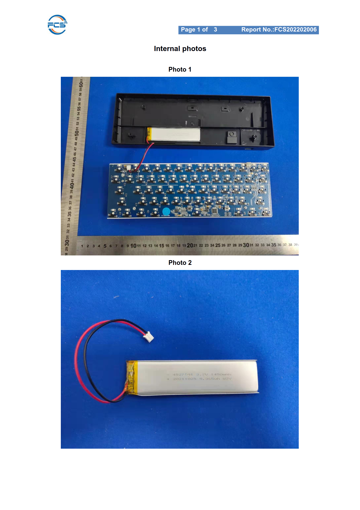
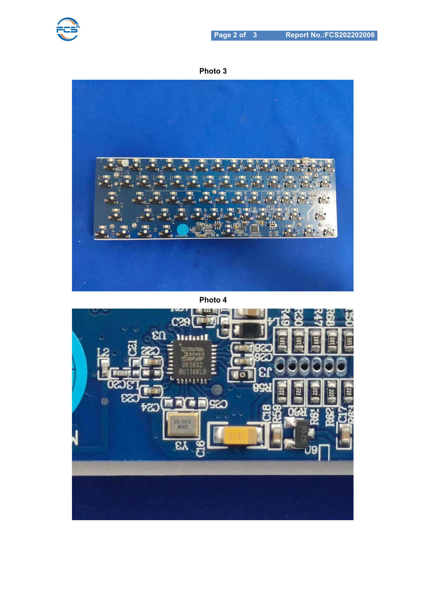
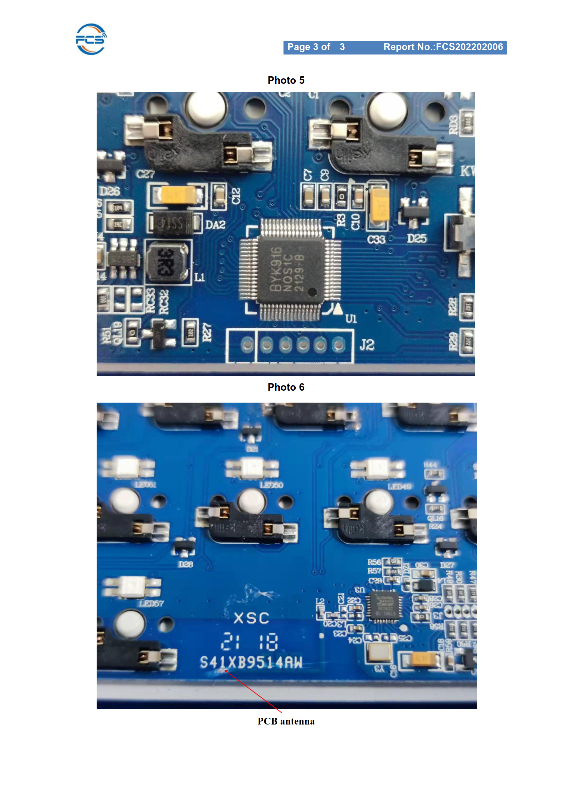

# Royal Kludge RK61 Plus

## Specs

- MCU: BYK916 ([SH68F90A](../platforms/sh68f90.md))
- Layout: 60% ANSI (61 keys)
- Matrix: 5 rows x 14 columns
- Backlight: per-key RGB
- Wireless: BK3632 (BT and 2.4G)
- Switches: hot-swap, plus a power on/off switch and a BLE/2.4G switch
- PCBs: three — a key-switch PCB, a small USB hub (1x USB-C in, USB-C + USB-A out), and the main keyboard PCB
- USB: `0603:1020` (stock device descriptor at `0xF9A8`)

## Pictures

FCC internal photos of the three PCBs:

| Page 1 | Page 2 | Page 3 |
| --- | --- | --- |
|  |  |  |

Full filing: [FCC ID 2A4MQ-RK61PLUS](https://fccid.io/2A4MQ-RK61PLUS)

## SMK Supported Features

- [x] Key Scan
- [x] Wireless
- [x] RGB Matrix

## Key matrix

Rows read back active-low on P7 and P5; columns are driven low one at a time.

| Row | Pin |
| --- | --- |
| R0 | P7.1 |
| R1 | P7.2 |
| R2 | P7.3 |
| R3 | P5.3 |
| R4 | P5.4 |

| Col | Pin | Col | Pin |
| --- | --- | --- | --- |
| C0 | P6.0 | C7 | P6.7 |
| C1 | P6.1 | C8 | P5.0 |
| C2 | P6.2 | C9 | P5.1 |
| C3 | P6.3 | C10 | P5.2 |
| C4 | P6.4 | C11 | P5.7 |
| C5 | P6.5 | C12 | P4.0 |
| C6 | P6.6 | C13 | P4.2 |

## Wireless (BK3632)

The radio is a BK3632, same part as the NuPhy Air60, but wired to different
pins:

| Signal | Pin |
| --- | --- |
| SCK (clock) | P4.7 |
| MOSI | P0.4 |
| MISO | P0.3 |
| CS | P4.4 |
| WAKE | P0.2 |
| ACK | P4.1 |

The BLE/2.4G switch selects the band; within BLE, the BT channel is chosen with
`Fn`+`Q`/`W`/`E` (`LNK_BT1`/`LNK_BT2`/`LNK_BT3`). A short press switches to that
channel, a long press starts pairing for it, and a short press on the active,
connected channel disables BLE and falls back to USB when a host is attached.
BLE takes priority while a BT channel is connected; USB is the fallback when no
BLE channel is active, and pressing a BT channel key re-enables it. On the direct
2.4G band the `Fn`+`Q`/`W`/`E` BLE keys are disabled.

The `Fn`+`Q`/`W`/`E` indicator shows the active channel: solid blue when
connected, slow blink while connecting, and fast blink while pairing.

## Battery monitoring

The SH68F90 has no ADC. The stock firmware measures the battery with a
bit-banged RC-timing loop on P0.0/P0.1: drive a pin low to discharge a
capacitor, release it, then time how long the other pin takes to flip — the
classic ADC substitute. It runs at every boot/wake (stock `0xF000` → `f770`),
kicks the watchdog while it measures, and stores the result in flag bit `0x04`.

SMK implements the same RC-timing path in `user_battery.c`, run at boot and on
wake: P0.1 discharges the capacitor and then charges it through its pull-up, and
a count loop (kicking the watchdog each iteration) times how long P0.0 stays high
before it flips. The count maps to `keyboard_state.battery_level` (0..7) and a
1-bit `low_power` flag (level ≤ 1). The 0..7 split is a first-order linear split
of the stock's 100-count window (`0x0E = 0x64`); the exact RC time constant is
board-dependent, so the thresholds need a hardware calibration pass.

## Other pins

| Pin | Stock role | Boot | Park |
| --- | --- | --- | --- |
| P0.5, P4.3, P4.5, P4.6, P7.4 | enable group — hub enable + charge enable + 3 more | 1 | 0 |
| P0.0, P0.1 | RC battery measurement | 0 | 0 |
| P0.6, P0.7 | status inputs (`0x309E` / `0x30A2`) | input | 0 |
| P7.0 | output, parked only | 0 | 0 |
| P7.5 | status input | input | input (never driven) |
| P7.6, P7.7 | control/status (`0x7B63` / `0x7D32` / `0xF9F0`) | 0 | 0 |
| P1.6/7, P2.6/7, P3.6/7 | NC / unbonded | — | — |

Boot values come from `MOV P0,#24` / `MOV P4,#FD` / `MOV P7,#10`; park values
from `ANL P0,#1F` / `ANL P0,#FC`, `ANL P4,#92`, `ANL P7,#EE` / `ANL P7,#3F`
(plus the full clear at `0xFC5F`). The five enable pins are driven high at boot
and low at park as one group — hub and charging are separate wires, but the
firmware never gates them individually.

## Switches

Two board switches are read as active-low inputs (pull-ups enabled):

| Switch | Pin | Stock read |
| --- | --- | --- |
| BLE/2.4G | P5.5 | `JNB P5.5` at `0x7C50` — high = 2.4G, low = BLE |
| on/off | P5.6 | `JNB P5.6` at `0x7C2A` / `0x7C3D` (debounced) |

Traced from the stock firmware's switch-poll routine (`0x7C00`). The on/off
switch is on P5.6; its assignment still needs hardware confirmation.

## Backlight

The backlight is a per-key RGB matrix driven by the SH68F90's PWM units. It is
the transpose of the NuPhy Air60 matrix: the PWM channels are the row/colour
sinks and the key-matrix columns are the LED columns.

| Side | Pins |
| --- | --- |
| Row/colour sinks (PWM) | P1.0-5 (PWM00-05), P2.0-5 (PWM10-15), P3.0-5 (PWM20-25) |
| LED columns | P6.0-7, P5.0-2, P5.7, P4.0, P4.2 |

Each keyboard row owns three consecutive PWM channels, in the order green, red,
blue:

| Row | Pins | Green | Red | Blue |
| --- | --- | --- | --- | --- |
| Ctrl (R4) | P1.0-2 | PWM00 | PWM01 | PWM02 |
| Shift (R3) | P1.3-5 | PWM03 | PWM04 | PWM05 |
| Tab (R1) | P2.0-2 | PWM10 | PWM11 | PWM12 |
| Caps (R2) | P2.3-5 | PWM13 | PWM14 | PWM15 |
| spare (unconnected) | P3.0-2 | PWM20 | PWM21 | PWM22 |
| Esc (R0) | P3.3-5 | PWM23 | PWM24 | PWM25 |

PWM bank 4 (PWM40-42) is unused.

Driving (traced from the stock firmware): the PWM registers are memory-mapped
(`MOVX @DPTR` at `0xFF80`-`0xFFF9`). Init (`0x6B14`) sets `CON`, `PER` (`0x0438`)
and a per-channel `DUTY1 = DUTY2` test ramp (`0x35, 0x36, ...`); the render paths
(`0x5xxx`, `0x5fxx`, `0x6bxx`, `0x97xx`) read the XRAM LED framebuffer and write
it to **DUTY2** — so DUTY2 is the animated duty and DUTY1 is the fixed on-time.

Because the LED columns share the key-matrix column pins, the matrix scan and the
LED scan must be time-multiplexed.

The GPIO pins P4.3, P4.5, P4.6, P0.5, P7.4 are not part of the RGB matrix (no
PWM channel maps to them) — they are driven in the "park" routine and are likely
USB-hub/charging control lines.

## Code Options

TBD — not yet traced on this board.
